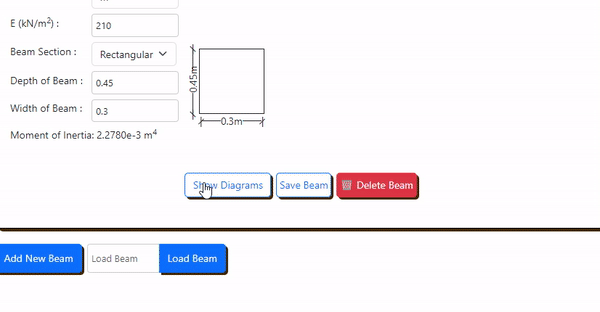

# Beam Calculator App

**Table of Contents**

- [Introduction](#introduction)
  - [Inspiration](#inspiration)
  - [How does this entire web app work?](#how-does-this-entire-web-app-work)
- [Installation and Running](#installation-and-running)
- [Distinctiveness and Complexity](#distinctiveness-and-complexity)
  - [Distinctiveness](#distinctiveness)
  - [Complexity](#complexity)
- [What’s contained in each file?](#whats-contained-in-each-file)
  - [Back-end File Structure](#back-end-file-structure)
  - [Front-end File Structure](#front-end-file-structure)
- [Additional Information](#additional-information)

## Introduction

- Purpose: The application is designed for modeling and analyzing beam structures.

- Analysis Method: It employs the finite element method for structural analysis. This method involves dividing the beam into several finite elements.

  - Element Division: The beam is divided into finite elements such that their maximum length is set to 0.05 times the total length of the beam. This factor of 0.05 can be easily modified in the views.py file.

  - Degrees of Freedom: Each nodes of beam element is considered to have two degrees of freedom. These are described as:
    - Rotation about the normal to the plane of the model (RZ).
    - Translation in the vertical direction (UY).

It was developed as a final project for CS50W, using React as frontend Javascript library, Django as backend Python framework and NumPy for calculation. Frontend sends data of a beam model to the backend via an HTTP request, and there is a Django model for handling the read and write operations of beam data in the database. Click [here](#distinctiveness) to learn about features.

- Demo video: [https://youtu.be/hzglLLgS51E](https://youtu.be/hzglLLgS51E)

## Inspiration

I, as a recent civil engineering graduate, always had the affinity for structural analysis and wanted my CS50W final project to be related to enginnering itself. I googled and found that the existing beam apps on the internet were not very fun to use, they need more interactivity. And thus, I began my journey by learning React and NumPy.

## How does this entire web app work?

The flowchart below shows integaration of different components of the web app.

- 

## Installation And Running

Directly run the command below on root directory (Assuming you have [Python](https://www.python.org/downloads/) and [NodeJs](https://nodejs.org/en/download) downloaded ):

For Windows

```
cd frontend
npm install
cd ..
python -m venv venv
venv\Scripts\activate
cd backend
pip install -r requirements.txt
cd ..
cd frontend
npm run start
```

For Linux and macOS

```
cd frontend
npm install
cd ..
python -m venv venv
source venv/bin/activate
cd backend
pip install -r requirements.txt
cd ..
cd frontend
npm run start
```

**OR** Do it manually:

- ### Installation

  - **Installing frontend dependencies:**
    1. Clone the repository to your local machine.
    2. Go to **frontend** directory run the command below to install necessary dependencies.
       ```
       npm install
       ```
  - **Installing python virtual environment and packages:**
    1. Create a python virtual environment and activate it.
    2. Go to root directory and navigate to the _backend_ directory.
    3. Install the required Python packages from requirements.txt using command below:
       ```
       pip install -r requirements.txt
       ```

- ### Running the appication

  **To start React and Django development server concurrently :** In _frontend directory_ run command below :

  ```
  npm run start
  ```

  **To start servers separately :**

  - In _frontend directory_ run command `npm run dev` to start React development server
  - In _backend directory_ run command `py manage.py runserver` to start Django development server.

## Distinctiveness and Complexity

### Distinctiveness

The Beam Calculator App stands out due to its combination of interactive modeling thanks to **React**, a javascript library and analysis of modelled beam in **Django backend** by **Finite Element Method** with the use of NumPy, a python library. Features like onboarding guide, save, load and print are plus points to this web project. The web app is **mobile responsive** as well. The distinctiveness are mentioned below:

- **Interactive Beam Modeling:**

  - Users can create their beam model by dragging and dropping elements like loads and supports onto the beam.

  - The position of loads and supports can be changed by simply dragging them along the beam or changed manually.
  - 

  - Distributed load changes its image when its loads are changed. User can also change colour of distributed load.
  - 

- **Finite Element Analysis with Numpy And Visualization:** Calculations done on backend are depicted as charts (Deformation Curve, Shear Force Diagram and Bending Moment Diagram) on Front-end for effective visualization.

  - 

- **Onboarding guide with intro.js:** Users are provided with onboarding guide option via welcome modal as well as a button on top section of the web app. The guide gives the tour of the most important features of this app so as to make users even more familiar when navigating.

  - 

- **Working with Multiple beams:** Users can **work with multiple beams** on a single app independently. This opens up possibility of comparing different beams.

- **Print:** Users can print the beam with its information and charts.

- **Save, Share and Delete:** Users can save their beam models and analysis for future reference. The application also allows users to share them with colleagues or peers easily. They can remove elements on a beam from view. Also, users can delete beams from database by logging in as admin in django server.

- **Other features:** The application allows users to specify units, beam length, and Young's Modulus to suit the material properties of their beams. Users can choose beam section from preset for automatic calculation of Moment of Inertia or specify the custom value. 
  
### Complexity

The project's complexity is evident in its use of multiple technologies and the integration of various components. Besides the integration part what I found the most complex in the projects were:

1. Logic for changing svg images dynamically based on value of loads on either ends(done in frontend/src/components/Img.jsx).
2. Logic for arranging data from frontend into NumPy arrays and converting distributed load into many finite elements (done in backend/api/arrangeData.py).
3. Logic for passing latest state of beam in different React components.

Different libraries and packages used in the app along with their usage are:

- Python Packages

  1. **NumPy :** It was used to make arrays of load, support condition, nodes and beam elements for mathematical operations related for Finite Element Analysis. Before feeding the

  2. **djangorestframework :** The api_view decorator was used in Django REST framework to define API views. Example : `@api_view(["GET"])`

  3. **django-cors-headers :** Django CORS Headers is a package for handling Cross-Origin Resource Sharing (CORS) in Django applications

- Dependencies in Front-end

  1. **axios:** It provides a simple API for performing HTTP requests and processing responses.

  2. **chart.js:** As its name suggest it was used to plot charts of **Deformation**, **Shear Force** and **Bending Moment**.

  3. **react-chartjs-2:** A React wrapper for Chart.js.

  4. **immer:** A package that was used to work with immutable state in a more convenient way.

  5. **interactjs:** A JavaScript library used for drag and drop features.

  6. **intro.js:** A library used for **onboarding guide**.

  7. **intro.js-react:** A React wrapper for intro.js.

  8. **react-bootstrap:** A library that combines Bootstrap with React. It allows developers to use Bootstrap's components and styles, but with React's syntax.

  9. **bootstrap:** A popular CSS framework used for pre-designed styles and components to build responsive, mobile-first web app.

  10. **react:** A JavaScript library for building user interfaces, primarily for single-page applications.

  11. **react-dom:** A package that provides DOM-specific methods that can be used at the top level of a web app to enable an efficient way of managing DOM elements of the web page.

  12. **concurrently:** A utility that manages multiple concurrent tasks. In this case, it was used to run both react and django using a single command `npm run start` in script of **package.json**.

      ```json
      // in package.json
        "start": "concurrently \"cd ../backend && python manage.py runserver\" \"vite\"",
      ```

## What’s contained in each file?

Files in both back-end and front-end along with their information are given below:

### Back-end File Structure

Inside back-end folder :

```
backend
├── api/               # Django API app directory
│   ├── __pycache__/   
│   ├── migrations/  
│   ├── __init__.py  
│   ├── admin.py       # Django admin configuration
│   ├── apps.py        
│   ├── arrangeData.py # Contains Function to arrange data from frontend into NumPy arrays
│   ├── beamApp.py     # Contains beam class to handle calculations
│   ├── models.py      # Contains Database model definition
│   ├── urls.py        # URL routing configuration
│   └── views.py       # Contains View functions for the 'api' app
├── beam/              
│   ├── __pycache__/   
│   ├── __init__.py    
│   ├── asgi.py        
│   ├── settings.py    
│   ├── urls.py        # Top-level URL routing configuration
│   └── wsgi.py        
├── db.sqlite3         
├── manage.py          
└── requirements.txt   # Contains Python package dependencies
```

### Front-end File Structure

Inside front-end folder :

```
frontend
├── public/                       # Contains images for README.md and About page
├── src/                          # Source code directory
│   ├── components/
│   │   ├── AboutPage.jsx         # Renders about page
│   │   ├── Beam.jsx              # Renders all beam and contains functions for making changes
│   │   ├── BeamInfo.jsx          # Contains input for beam properties
│   │   ├── Chart.jsx             # Makes charts
│   │   ├── CopyButton.jsx        # Copies saved beam no. to clipboard
│   │   ├── DndStage1.jsx         # Handles dropping of elements on beam
│   │   ├── DndStage2.jsx         # Handles dragging of elements on beam
│   │   ├── FixedEnds.jsx         # Toggle for fixed ends supports
│   │   ├── Img.jsx               # Contains svg images of elements
│   │   ├── InputBeamLength.jsx   # Changes length of a beam
│   │   ├── LoadBeam.jsx          # Loads a beam from its reference no.
│   │   ├── Message.jsx           # Displays messages dynamically
│   │   ├── OnBoarding.jsx        # Contains Logic for onboarding tour
│   │   ├── PositionDimension.jsx # Changes position dimensions when there is any change
│   │   ├── Print.jsx             # Prints the beam and charts
│   │   ├── SaveBeam.jsx          # Sends a beam to backend to be saved.
│   │   ├── Switch.jsx            # Toggles for length, load and border display
│   │   ├── ToolBar.jsx           # Contains toolbox of draggable elements
│   │   ├── utility.js            # Contains fuction for random colour and hexToRGBA
│   │   └── WelcomeModal.jsx      # Lunches Welcome Modal
│   ├── dataFlow/
│   │   ├── axios.jsx             # Input for baseUrl of backend server
│   │   └── sendDataToBackend.jsx # Sends data to backend
│   ├── App.css                   # Contains CSS styles
│   ├── App.jsx                   # React application entry point
│   └── main.jsx                  # Main JavaScript file
├── .eslintrc.cjs                 # ESLint configuration
├── index.html                    # HTML entry point
├── package-lock.json             # Lock file for npm packages
├── package.json                  # npm package dependencies
└── vite.config.js                # Configuration for Vite.js (build tool)

```

## Additional Information

- Both default username and password for Django admin panel is **admin** at "http://127.0.0.1:8000/admin"
  
- If the Django Server is being run on other address from "http://127.0.0.1:8000" then you can update baseURL in axios.jsx file:

  ```
   frontend
    └── src/
         └── dataFlow/
              └── axios.jsx

  const API = axios.create({
      baseURL: "http://127.0.0.1:8000",
  });
  ```

- The frontend and backend are separated, that means the user can change method of analysis in backend to any methods while using the beautiful frontend as it is.

- For optimal printing, it may be necessary to adjust the dimensions of the PDF. While testing on desktops using Edge and Chrome, the prints were satisfactory.

## Contacts

Any feedback will be highly appreciated.

<a href="mailto:mrajayakhatri@gmail.com" target="blank">mrajayakhatri@gmail.com</a>

<a href="https://linkedin.com/in/ajaya-khatri-7b9715254" target="blank">ajayakhatri</a>
